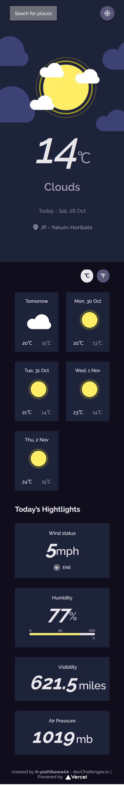
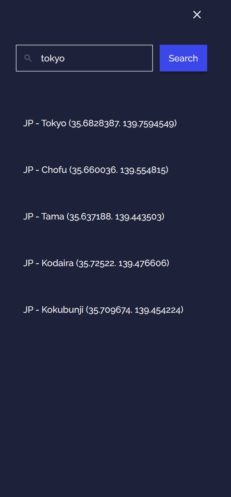

<!-- Please update value in the {}  -->

<h1 align="center">Weather app</h1>

<div align="center">
   Solution for a challenge from  <a href="http://legacy.devchallenges.io" target="_blank">Devchallenges.io</a>.
</div>

<div align="center">
  <h3>
    <a href="https://ch-weather-app.vercel.app/">
      Demo
    </a>
    <span> | </span>
    <a href="https://legacy.devchallenges.io/solutions/1juVePEnnmpjMCzrbvRr">
      Solution
    </a>
    <span> | </span>
    <a href="https://legacy.devchallenges.io/challenges/mM1UIenRhK808W8qmLWv">
      Challenge
    </a>
  </h3>
</div>

<!-- TABLE OF CONTENTS -->

## Table of Contents

- [Table of Contents](#table-of-contents)
- [Overview](#overview)
  - [Desktop](#desktop)
  - [Mobile](#mobile)
  - [Built With](#built-with)
- [Features](#features)
- [How To Use](#how-to-use)
- [learned/improved](#learnedimproved)
- [Acknowledgements](#acknowledgements)
- [Contact](#contact)

<!-- OVERVIEW -->

## Overview
### Desktop
base


menu


### Mobile
base



menu



When you access the app, it gets your location and retrieves and displays the weather forecast for that nearest location.
(If you don't allow it to get your location, it will default to Tokyo.)

Click the button to the right of "Search for places" to request the above process again.  
The menu that opens from "Search for places" allows you to search for a location and display the weather forecast for the selected location.

### Built With

<!-- This section should list any major frameworks that you built your project using. Here are a few examples.-->

Base
- [Node.js](https://nodejs.org/)：22.13.1
- [TypeScript](https://www.typescriptlang.org/)：5.7.3
- [React](https://reactjs.org/)：19.0.0
- [Next.js](https://nextjs.org/)：13.5.6

Other major libraries
- [emotion](https://emotion.sh/)
- [@emotion-icons](https://github.com/emotion-icons/emotion-icons)
- [ky-universal](https://github.com/sindresorhus/ky-universal)
- [polished](https://polished.js.org/)
- [postcss-preset-env](https://github.com/csstools/postcss-plugins/tree/main/plugin-packs/postcss-preset-env)
- [wicg-inert](https://github.com/WICG/inert)

API
- [OpenWeather API](https://openweathermap.org/)

## Features

<!-- List the features of your application or follow the template. Don't share the figma file here :) -->

This application/site was created as a submission to a [DevChallenges](https://legacy.devchallenges.io/challenges) challenge. The [challenge](https://legacy.devchallenges.io/challenges/mM1UIenRhK808W8qmLWv) was to build an application to complete the given user stories.

- [x] User story: I can see city weather as default, preferably my current location
- [x] User story: I can search for city
- [x] User story: I can see weather of today and the next 5 days
- [x] User story: I can see the date and location of the weather
- [x] User story: I can see according to image for each type of weather
- [x] User story: I can see the min and max degree each day
- [x] User story: I can see wind status and wind direction
- [x] User story: I can see humidity percentage
- [x] User story: I can see a visibility indicator
- [x] User story: I can see the air pressure number
- [x] User story(optional): I can request my current location weather
- [x] User story(optional): I can convert temperature in Celcius to Fahrenheit and vice versa

## How To Use

<!-- Example: -->

To clone and run this application, you'll need [Git](https://git-scm.com) and [Node.js](https://nodejs.org/en/download/) (which comes with [npm](https://www.npmjs.com/)) installed on your computer. From your command line:

```bash
# Clone this repository
git clone https://github.com/h-yoshikawa44/ch-weather-app.git
or
git clone git@github.com:h-yoshikawa44/ch-weather-app.git

# Setting Env(Set each value according to your environment.)
cp .env.example .env

# Install dependencies
npm install

# Run the app
npm run start
```

## learned/improved
- How to change the color of the background image.
- Basic usage of the meter element.
- How to style the meter element.
- How to control anomalous menus by window size.
- How to do a type guard for the Union type.

## Acknowledgements

<!-- This section should list any articles or add-ons/plugins that helps you to complete the project. This is optional but it will help you in the future. For example: -->

- [CSSだけでbackground-imageに設定した画像の色を変える](https://hyperts.net/css-image-color/)
- [MDN - meter: HTML メーター要素](https://developer.mozilla.org/ja/docs/Web/HTML/Element/meter)
- [meter要素のスタイリングについてのメモ 2012年10月](https://unformedbuilding.com/articles/styling-meter-element-2012-10/)
- [TypeScript Union 型に含まれる値かどうか判定したい](https://chaika.hatenablog.com/entry/2021/11/03/083000)

## Contact

- Website：[h-yoshikawa44.com](https://h-yoshikawa44.com)
- GitHub：[@h-yoshikawa44](https://github.com/h-yoshikawa44)
- Twitter：[@yoshi44_lion](https://twitter.com/yoshi44_lion)
